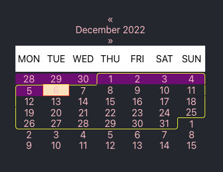

# react-calendar
#### version 1.0.0
### React calendar library with border for the current viewing month.
### The number of weeks to view includes the current month and 2 weeks of the next month

#### step 0 into folder reactjs-calendar
#### step 1 install: >yarn
#### step 2 start: >yarn start